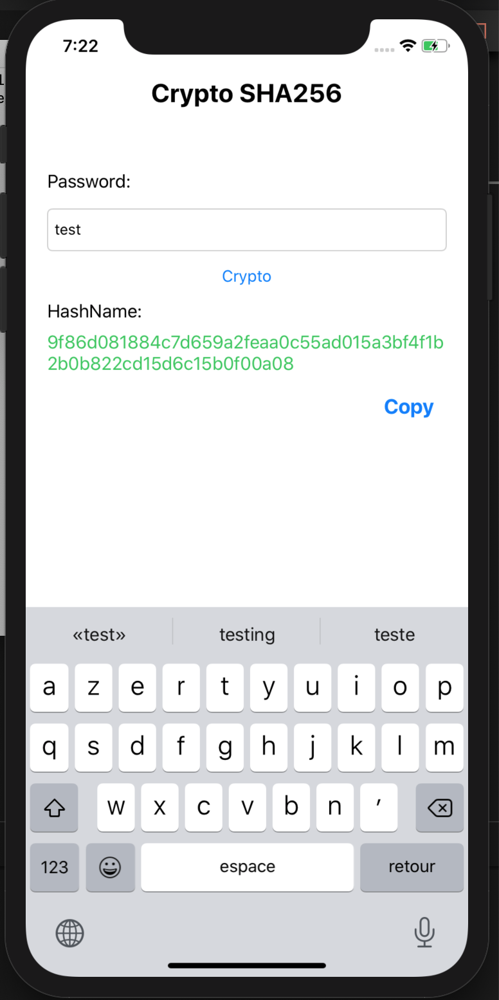
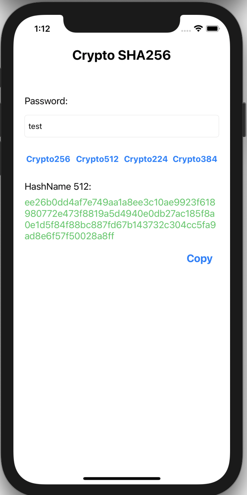

# Swift-CryptoSHA
============

Swift Crypto SHA256,  SHA51,2 SHA224 and SHA384

## Getting Started

An [example ViewController](https://github.com/devzhr/Swift-CryptoSHA/blob/master/Example/sha256/ViewController.swift) is included demonstrating CryptoSHA's functionality.

<p align="left">
	<a href="https://developer.apple.com/swift"></a>
	<a href="https://cocoapods.org/pods/ScrollableDatepicker"></a>
	
	<a href="https://raw.githubusercontent.com/devzhr/Swift-CryptoSHA/master/LICENSE"></a>
</p>

&nbsp;&nbsp;&nbsp;&nbsp;

## How do I get involved?

You want to help, great! Go ahead and fork our repo, make your changes and send us a pull request.


## Installation

### CocoaPods

Add the following line to your Podfile:

```ruby
pod 'CryptoSHA', :git => 'https://github.com/devzhr/Swift-CryptoSHA.git', :tag => '0.0.2'
```
Then run the following in the same directory as your Podfile:

```ruby
pod install
```
### Manual

Clone the repo and drag files from `Sources` folder into your Xcode project.
